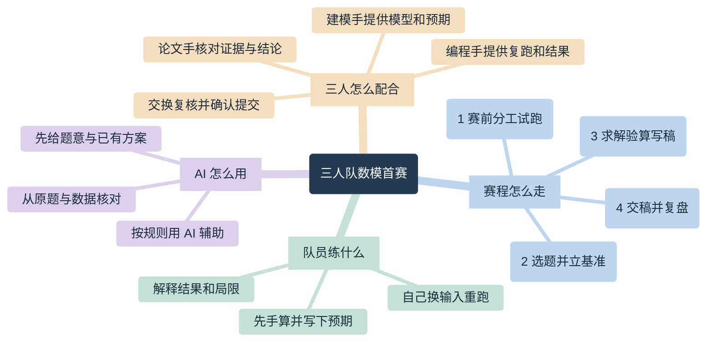

# 首次数学建模比赛思维导图

四条分支对应首赛手册里的赛程、能力训练、AI 使用和三人交接。按手册的八步推进。

```mermaid
%%{init: {"theme":"base","themeVariables":{"fontFamily":"Microsoft YaHei, Noto Sans CJK SC, sans-serif","fontSize":"17px","background":"#ffffff","git0":"#243B53","gitBranchLabel0":"#FFFFFF","cScale0":"#243B53","cScale1":"#BDD5EF","cScale2":"#C5E1D6","cScale3":"#DDD0EB","cScale4":"#F4DEBD","cScaleLabel1":"#1B2B3D","cScaleLabel2":"#1B2B3D","cScaleLabel3":"#1B2B3D","cScaleLabel4":"#1B2B3D"}}}%%
mindmap
  first(三人队数模首赛)
    roadmap[赛程怎么走]
      prepare(1 赛前分工试跑)
      select(2 选题并立基准)
      solve(3 求解验算写稿)
      close(4 交稿并复盘)
    growth[队员练什么]
      先手算并写下预期
      自己换输入重跑
      解释结果和局限
    ai[AI 怎么用]
      先给题意与已有方案
      按规则用 AI 辅助
      从原题与数据核对
    team[三人怎么配合]
      建模手提供模型和预期
      编程手提供复跑和结果
      论文手核对证据与结论
      交换复核并确认提交
```

[首赛手册](../docs/team-playbook.md) · [原始 Mermaid 文件](first-contest-mindmap.mmd) · [图片版](first-contest-mindmap.png)
